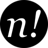

### :shit: Crapware warning! :shit:
Almost badly written, badly commented and documented, badly extensible, not usable and not tested. I'm working on it in the few spare time!

# nope!
**nope!** (_a.k.a._ **n!**) is a content management system written in PHP suitable for small projects.

## Requirements

- PHP >= 5.5.x (with _PDO_ and _SQLite_)
- Apache2 >= 2.4.x (with *mod_rewrite*)

## Libraries
**n!** does not pretend to reinvent the wheel, so it takes advantage of the following libraries:

- [Slim framework][slim]
- [RedbeanPHP][redbeanphp]
- [Respect\Validation][validation]
- Intervention
- League\Event

Administration interface is built on top of:

- [AngularJS][angular]
- [Bootstrap 3][bootstrap] (no jQuery!)
- Font Awesome

## License
See [LICENSE](LICENSE) file.

[angular]: https://angularjs.org/
[bootstrap]: http://getbootstrap.com/
[redbeanphp]: http://www.redbeanphp.com/
[slim]: http://www.slimframework.com/
[validation]: https://github.com/Respect/Validation
